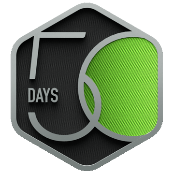

# Hi there 👋, I'm Vidhi Inchure

## 🚀 About Me

🎓 Electronics & Telecommunication Engineering with Cybersecurity Honors Student (SPPU)
🔐 Aspiring Cybersecurity Engineer | Ethical Hacker | AI Security Enthusiast
💻 Passionate about Offensive Security, AI Security, Detection Engineering, Digital Forensics & Secure Software Development
🌱 Currently learning:

* Certified Ethical Hacker (CEH v13)
* Detection Engineering
* DevSecOps
* Secure Code Development
* AI Security & LLM Security

I enjoy solving security challenges, building practical cybersecurity tools, and exploring how AI can both strengthen and threaten modern security systems.

---

## 🛠️ Tech Stack

### Languages

* Python
* C
* C++
* Java
* JavaScript
* MySQL

### Cybersecurity

* Kali Linux
* OWASP Top 10
* Web Application Security
* Digital Forensics
* OSINT
* Network Security

### AI & Development

* React
* Node.js
* Express.js
* Firebase
* Google AI Studio
* Gemini API
* Tailwind CSS
* Git & GitHub

### Databases

* MySQL

---

## 🚩 Current Focus

* 🔴 AI Security Research
* 🛡️ Enterprise AI Security
* 🔍 Vulnerability Assessment & Penetration Testing
* ⚙️ Detection Engineering
* 🤖 AI-powered Security Automation
* 📈 LeetCode & DSA (Python)
* 🏁 Capture The Flag (CTFs)

---

## 🏆 Certifications

* Certified Ethical Hacker (CEH) *(In Progress)*
* Windows Digital Forensics  *(In Progress)*
* DPDPA 2023  *(In Progress)*
* Prompt Engineering 
* Deep Learning
* Agile Scrum
* Arduino & C Training
* Google AI Learning
* Multiple Cybersecurity Virtual Experiences

---

## 🧩 LeetCode

---

## 🤝 Let's Connect

* 💼 LinkedIn: https://www.linkedin.com/in/vidhiinchure

---

> *"Security isn't just about defending systems—it's about continuously learning how attackers think and building resilient solutions for tomorrow."*
